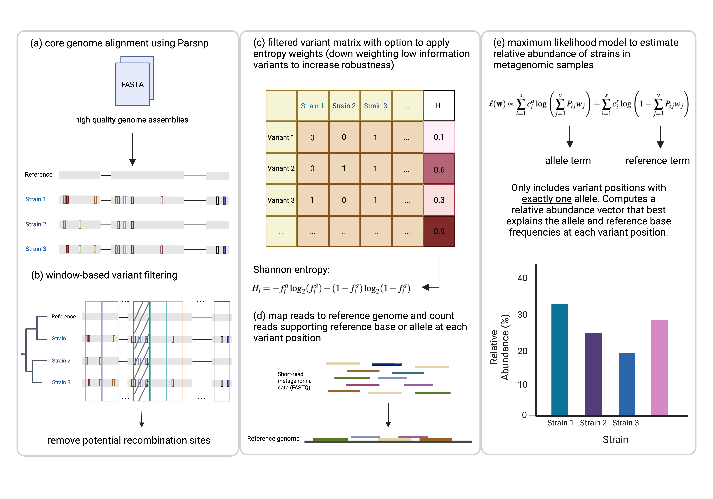

# Strainify
<p align="center">
  
</p>


Strainify is an accurate strain-level abundance analysis tool for short-read metagenomics.

## Strainify Workflow
<p align="center">
  
</p>

## Installation


### Clone the repository

```bash
git clone https://github.com/treangenlab/Strainify.git
cd Strainify
```

### Set up conda environment
```bash
# For Linux:
conda env create -f environment.yaml

# Activate conda environment
conda activate strainify
```

## Usage
Strainify uses a `config.yaml` file to manage input files and parameters.

### Parameters
These fields can be set in `config.yaml`:

| Parameter                  | Description                                                                                                         | Default                         | Accepted Values                              |
|----------------------------|---------------------------------------------------------------------------------------------------------------------|----------------------------------|-----------------------------------------------|
| `genome_folder`            | **(Required)** Path to the folder containing reference genome files (FASTA format).                                                | —                                | A valid directory path                        |
| `fastq_folder`             | **(Required)** Path to the folder containing input FASTQ files (must be unzipped and named using `*_r1.fq`, `*_r2.fq`). Multiple samples can be added to this folder (for paired-end reads, make sure the two FASTQ files for each sample have matching names).             | —                                | A valid directory path                        |
| `output_dir`               | **(Required)** Directory where all output files will be saved.                                                                     | —                       | A valid directory path                        |
| `read_type`                | Type of sequencing reads.                                                                                           | `paired`                         | `paired` or `single`                          |
| `window_size`              | Size of the genomic window for variant grouping. Can also be set to `average_LCB_length` to use the average length of local colinear blocks from Parsnp. | `500`                            | Any positive integer or `average_LCB_length` |
| `window_overlap`           | Proportion of overlap between consecutive windows.                                                                  | `0`                              | Float between `0` and `1` (e.g., `0.5`)       |
| `weight_by_entropy`        | Whether to weight variants by their Shannon entropy when estimating strain abundances.                              | `false`                          | `true` or `false`                             |
| `use_precomputed_variants`| Use existing filtered variant matrix instead of recomputing from scratch.                                           | `false`                          | `true` or `false`                             |
| `precomputed_output_dir`  | Path to directory where new output will be saved.                                                        | `output_dir/precomputed_results` | A valid directory path                        |
| `parsnp_flags`  | Parsnp flags                                                        | `-c` (force inclusion of all genomes) | Valid Parsnp flags (see `parsnp -h` for available parameters)                        |
| `filter_off`  | Option to turn off the recombination filter (recommended when input genomes differ by less than 500 variants to maximize Strainify's resolution)                                                       | `false`  | `true` or `false`                        |
| `bootstrap`  | Run bootstrapping to estimate uncertainty (95% confidence intervals)                                                        | —  | If the `--bootstrap` flag is provided to the `bootstrap` parameter, bootstrapping will be applied when computing relative abundances. Bootstrap iterations can be set via the `--bootstrap_iterations` flag (default: 100)                        |


### Edit the `config.yaml`
Open `config.yaml` in a text editor. Modify the fields to match your input and desired options. Example:

```yaml
genome_folder: path/to/genomes
output_dir: path/to/output
fastq_folder: path/to/fastqs
read_type: paired
modify_windows: --window_size 500 --window_overlap 0
weight_by_entropy: false
use_precomputed_variants: false
parsnp_flags: -c
filter_off: false
#bootstrap: --bootstrap --bootstrap_iterations 100
precomputed_output_dir: path/to/new_output
```

### Running Strainify
```bash
./strainify run --cores 12 --configfile config.yaml
```
>Tip: Replace `12` with the number of CPU cores you want to allocate.
>You can set `--cores` to any positive integer, depending on your system’s available resources.

If you prefer not to use a config file, you can also pass everything to Strainify via `--config`. Example:
```bash
./strainify run --cores 12 \
  --config genome_folder=path/to/genomes output_dir=path/to/output fastq_folder=path/to/fastqs
```


### Running Strainify with pre-filtered reference genomes
If you suspect that some of your input reference genomes might not actually be present in the metagenomic samples you are analyzing, we recommend pre-filtering the reference genomes to avoid potential false positives in Strainify's output. This step will concatenate all input reference FASTAs into one, and map the FASTQ reads to this concatenated FASTA. After filtering for high confidence, uniquely mapped reads, the genomes in the original set of FASTAs that have zero reads mapped to them will be discarded (they are unlikely to be present in the metagenomic data). 

The following command will run the pre-filtering step and then run Strainify with only genomes that passed the filter:
```bash
./strainify filter-run \
  --genomes /path/to/genomes \
  --fastqs /path/to/fastqs \
  --out /path/to/output \
  --configfile /path/to/config.yaml \
  --config <key1=value1 key2=value2 ...>
  --threads 12
```
A config file is required here, but specific parameters can be overridden via `--config`. Refer to `./strainify filter-run --help` for more details on usage. 

>Tip: `--out` points to the directory for the pre-filtering step's output. Within this directory, the subfolder `filtered_genomes` contains the genomes that passed the filter, and the file `genomes_with_zero_coverage_across_all_samples.txt` contains the names of genomes that did not pass the filter. 


## Tutorial / Examples

For step-by-step instructions using example data, see the tutorial:

[Strainify Tutorial](documentation/tutorial.md)


## Reproducing paper analyses
Please refer to the scripts and documentation in this repository:
https://github.com/treangenlab/Strainify_paper
## Strainify Preprint
Strainify: Strain-Level Microbiome Profiling for Low-Coverage Short-Read Metagenomic Datasets
https://www.biorxiv.org/content/10.1101/2025.10.10.681738v2

## Questions / Contact

For questions or suggestions, open an issue or contact Rossie Luo at [rl152@rice.edu](mailto:rl152@rice.edu).

